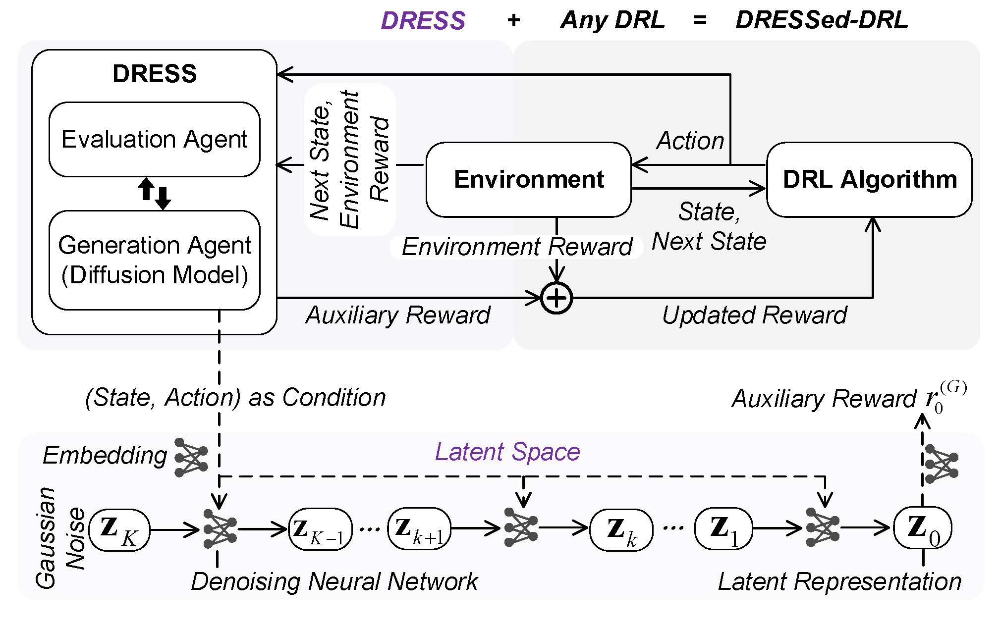
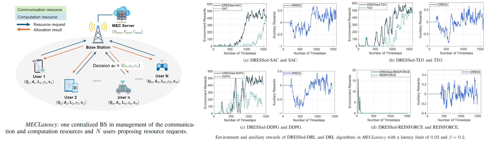
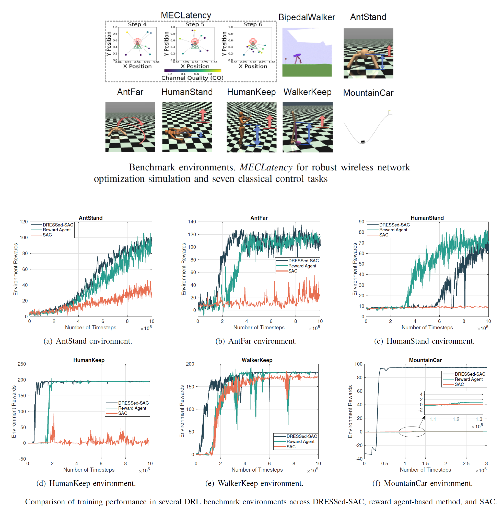

<div align="center">
 <h1>🥼 DRESS</h1>

 <h3>DRESS: Diffusion Reasoning-based Reward Shaping Scheme for Intelligent Networks</h3>

 <p align="center">
 <em>"If your DRL's a mess, DRESS it!"</em> 
 </p>
[](https://opensource.org/licenses/MIT)
[](https://www.python.org/downloads/)
[](https://pytorch.org/)
[](https://arxiv.org/abs/2503.07433)

 
 
</div>

---

This repository contains an implementation of the DRESS algorithm as presented in the paper *"DRESS: Diffusion Reasoning-based Reward Shaping Scheme For Intelligent Networks"* by Feiran You, Hongyang Du, Xiangwang Hou, Yong Ren, and Kaibin Huang.


## 🔧 Environment Setup

To create a new conda environment, execute the following command:

```bash
conda create --name dress python==3.9
```
## ⚡Activate Environment

Activate the created environment with:

```bash
conda activate dress
```

## 📦 Install Required Packages

The following packages can be installed using pip:

```bash
pip install gymnasium==0.29.1
pip install numpy==1.25.2
pip install torch==2.0.1
pip install tensorboard==2.14.0
pip install stable_baselines3==2.1.0
pip install matplotlib==3.8.0
pip install gymnasium[box2d]
pip install wandb
```

For wandb, log in and paste your API key when prompted.
```bash
wandb login
```

For gymnasium box2d, if you met errors when using Windows, you can try:
```bash
conda install -c conda-forge box2d-py
pip install pygame
```

## 🏃‍♀️ Run the Program

```bash
python main.py --env-id BipedalWalker-v3
```

### Command Line Arguments

The framework supports the following configuration options:

| Argument | Type | Default | Description |
|----------|------|---------|-------------|
| `--s-reward-shaping` | bool | `True` | Enable/disable reward shaping |
| `--use-diffusion` | bool | `True` | Enable/disable diffusion model for reward shaping |
| `--beta` | float | `0.2` | Controls the strength of the auxiliary reward |

### Explanation

- **Standard DRL**: When `--s-reward-shaping=False`, the algorithm operates as standard deep reinforcement learning without any reward shaping.

- **Neural Network Reward Shaping**: When `--s-reward-shaping=True` and `--use-diffusion=False`, a neural network is used as the reward agent for reward shaping.

- **DRESSed-DRL**: When both `--s-reward-shaping=True` and `--use-diffusion=True`, the algorithm operates in DRESSed-DRL mode, employing diffusion models for reward shaping.

The `--beta` parameter controls the strength of the auxiliary reward's influence on the learning process. Higher values give more weight to the shaped reward component.

## 🔍 Check the results

Same env, different DRESSed-DRL algorithms:



DRESSed-SAC, different envs:



## 📚 Cite Our Work

Should our code assist in your research, please acknowledge our work by citing:

```bib
@article{you2025dress,
 title={DRESS: Diffusion Reasoning-based Reward Shaping Scheme For Intelligent Networks},
 author={You, Feiran and Du, Hongyang and Hou, Xiangwang and Ren, Yong and Huang, Kaibin},
 journal={arXiv preprint arXiv:2503.07433},
 year={2025}
}
```

## Acknowledgments

This project draws inspiration from and references code from the following repositories:
- [Diffusion Policy](https://github.com/irom-princeton/dppo/tree/main)
- [DDPM](https://github.com/abarankab/DDPM)
- [DDIM](https://github.com/ermongroup/ddim/tree/main)
- [ReLara](https://github.com/mahaozhe/ReLara/tree/main)
- [DRL-Pytorch](https://github.com/XinJingHao/DRL-Pytorch)

We provide SAC base implementation in the `drl_algorithms` folder. If you want to try more DRL environments, please refer to [DRL-Pytorch](https://github.com/XinJingHao/DRL-Pytorch) and add them to the `drl_algorithms` folder using a similar approach, then call them from `main.py`.


